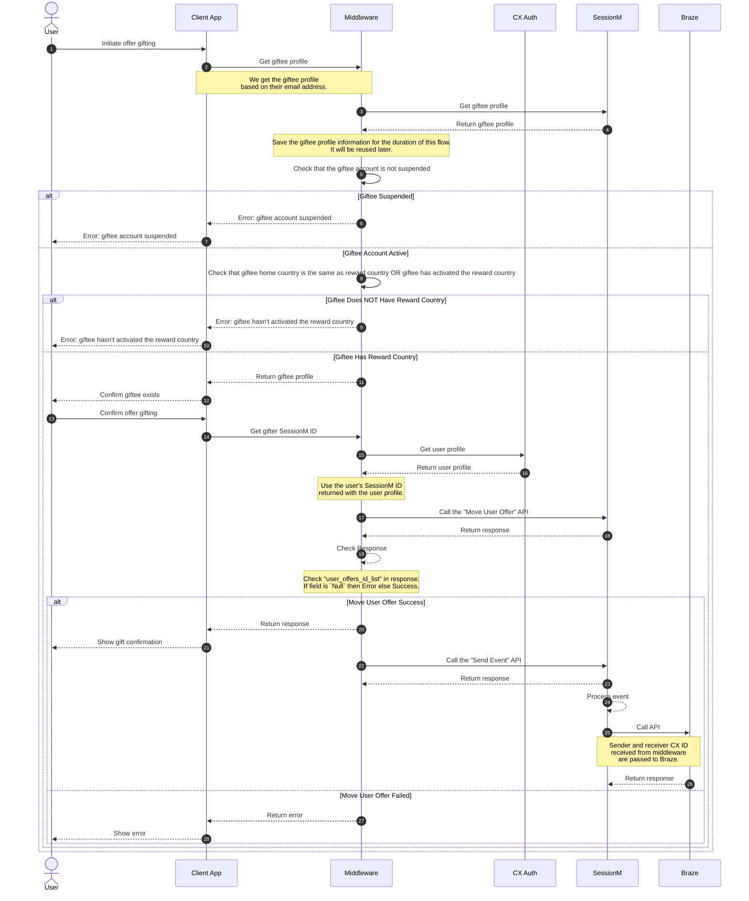

# CBTL Reward Gifting Diagram

```mermaid
sequenceDiagram
  autonumber

  actor User
  participant Client as Client App
  participant Mid as Middleware
  participant CX as CX Auth
  participant SM as SessionM
  participant BZ as Braze

  User ->> Client: Initiate offer gifting
  Client ->> Mid: Get giftee profile
  Note over Client, Mid: We get the giftee profile<br>based on their email address.
  Mid ->> SM: Get giftee profile
  SM -->> Mid: Return giftee profile
  Note over Mid: Save the giftee profile information for the duration of this flow.<br>It will be reused later.
  Mid ->> Mid: Check that the giftee account is not suspended

  alt Giftee Suspended
    Mid -->> Client: Error: giftee account suspended
    Client -->> User: Error: giftee account suspended
  else Giftee Account Active
    Mid ->> Mid: Check that giftee home country is the same as reward country OR giftee has activated the reward country

    alt Giftee Does NOT Have Reward Country
      Mid -->> Client: Error: giftee hasn't activated the reward country
      Client -->> User: Error: giftee hasn't activated the reward country
    else Giftee Has Reward Country

        Mid -->> Client: Return giftee profile

        Client -->> User: Confirm giftee exists
        User ->> Client: Confirm offer gifting
        Client ->> Mid: Get gifter SessionM ID
        Mid ->> CX: Get user profile
        CX -->> Mid: Return user profile
        Note over Mid: Use the user's SessionM ID<br>returned with the user profile.
        Mid ->> SM: Call the "Move User Offer" API
        SM -->> Mid: Return response
        Mid -->> Mid: Check Response
        Note over Mid: Check "user_offers_id_list" in response.<br>If field is `Null` then Error else Success.

        alt Move User Offer Success
        Mid -->> Client: Return response
        Client -->> User: Show gift confirmation
        Mid ->> SM: Call the "Send Event" API
        SM -->> Mid: Return response
        SM -->> SM: Process event
        SM ->> BZ: Call API
        Note over SM, BZ: Sender and receiver CX ID<br>received from middleware<br>are passed to Braze.
        BZ -->> SM: Return response
        else Move User Offer Failed
        Mid -->> Client: Return error
        Client -->> User: Show error
        end
    end
  end
```