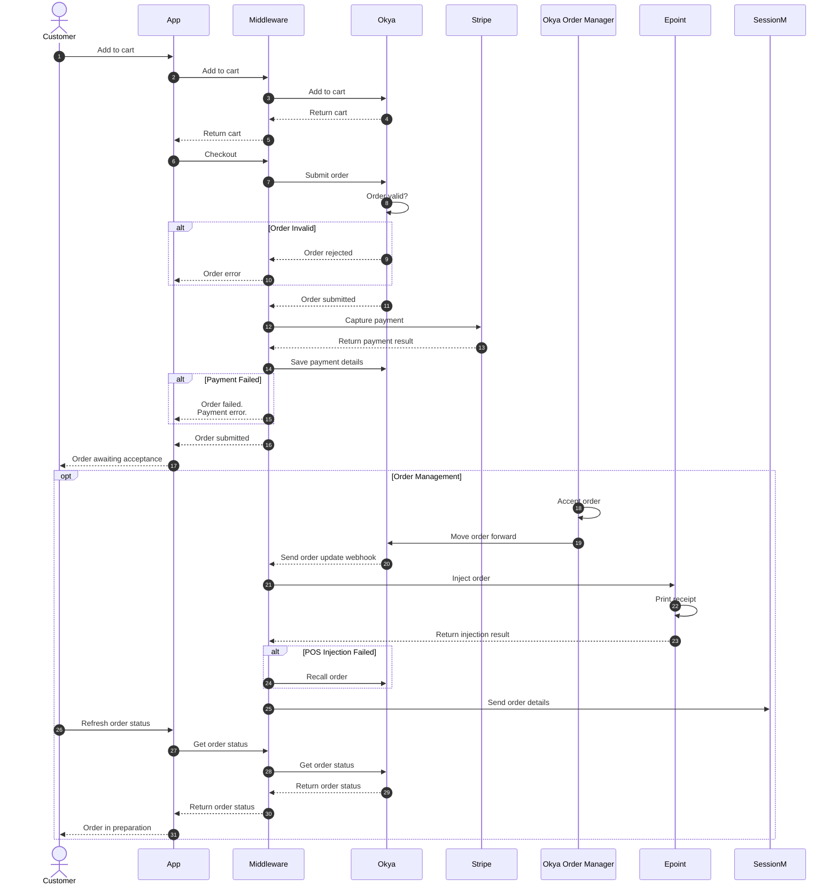
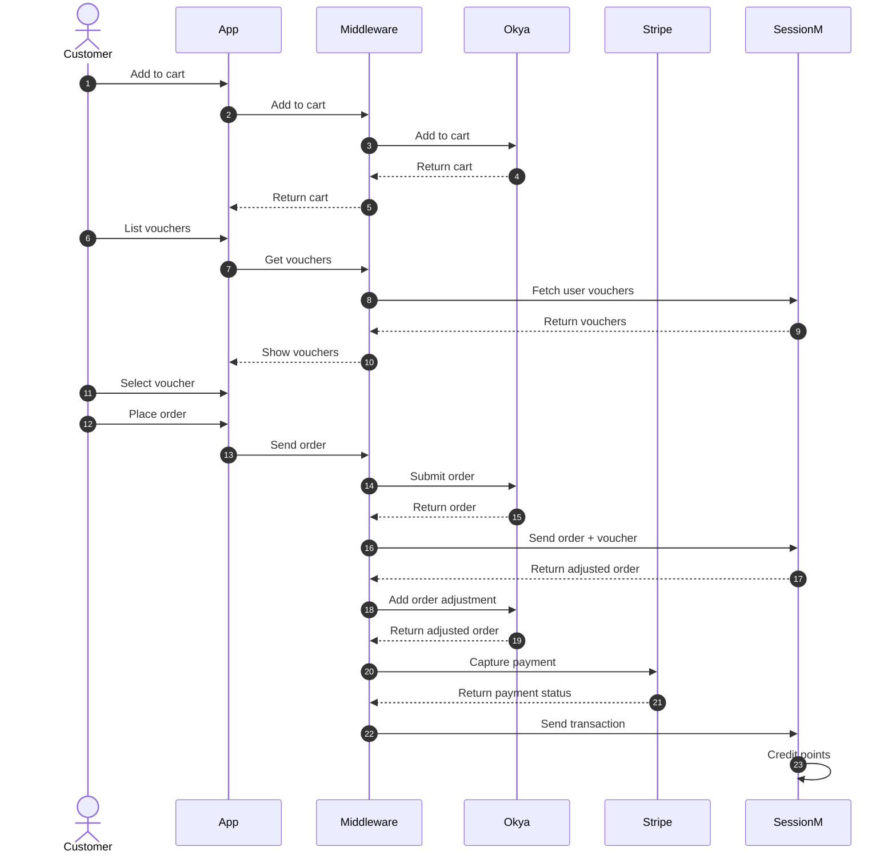
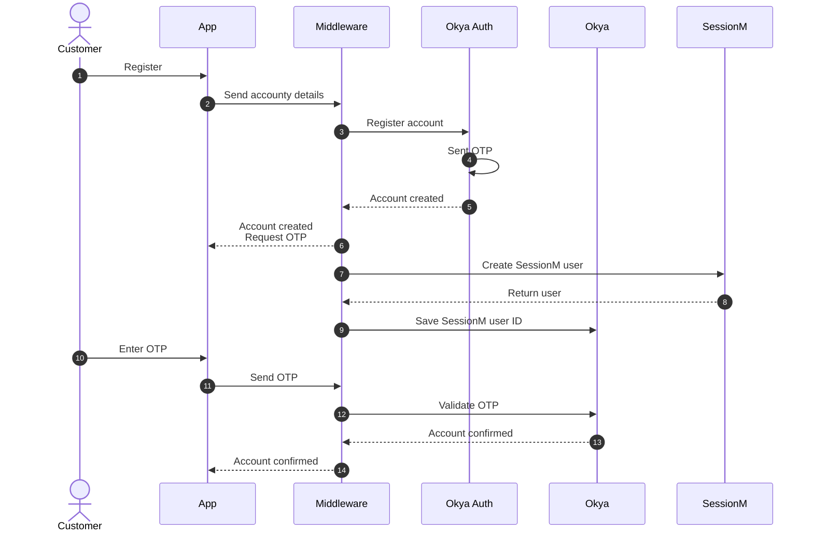

# CBTL Sequence Diagrams

# Place Order

```mermaid
sequenceDiagram
  autonumber
  
  actor Customer
  participant App as App
  participant Mid as Middleware
  participant OK as Okya
  participant S as Stripe
  participant OM as Okya Order Manager
  participant POS as Epoint
  participant SM as SessionM
  
  Customer->>App: Add to cart
  App->>Mid: Add to cart
  Mid->>OK: Add to cart
  OK-->>Mid: Return cart
  Mid-->>App: Return cart
  App->>Mid: Checkout
  Mid->>OK: Submit order
  OK->>OK: Order valid?
  
  alt Order Invalid
	  OK-->>Mid: Order rejected
	  Mid-->>App: Order error
  end
  
  OK-->>Mid: Order submitted
  Mid->>S: Capture payment
  S-->>Mid: Return payment result
  Mid->>OK: Save payment details
  
  alt Payment Failed
	  Mid-->>App: Order failed.<br>Payment error.
  end
  
  Mid-->>App: Order submitted
  App-->>Customer: Order awaiting acceptance
  
  Opt Order Management
	  OM->>OM: Accept order
	  OM->>OK: Move order forward
	  OK-->>Mid: Send order update webhook
	  Mid->>POS: Inject order
	  POS->>POS: Print receipt
	  POS-->>Mid: Return injection result
	  
	  alt POS Injection Failed
		  Mid->>OK: Recall order
	  end
	  
	  Mid->>SM: Send order details
	  Customer->>App: Refresh order status
	  App->>Mid: Get order status
	  Mid->>OK: Get order status
	  OK-->>Mid: Return order status
	  Mid-->>App: Return order status
	  App-->>Customer: Order in preparation
	 end
  
```

# Use Reward

```mermaid
sequenceDiagram
  autonumber
  
  actor Customer
  participant App as App
  participant Mid as Middleware
  participant OK as Okya
  participant S as Stripe
  participant SM as SessionM
  
  Customer->>App: Add to cart
  App->>Mid: Add to cart
  Mid->>OK: Add to cart
  OK-->>Mid: Return cart
  Mid-->>App: Return cart
  Customer->>App: List vouchers
  App->>Mid: Get vouchers
  Mid->>SM: Fetch user vouchers
  SM-->>Mid: Return vouchers
  Mid-->>App: Show vouchers
  Customer->>App: Select voucher
  Customer->>App: Place order
  App->>Mid: Send order
  Mid->>OK: Submit order
  OK-->>Mid: Return order
  Mid->>SM: Send order + voucher
  SM-->>Mid: Return adjusted order
  Mid->>OK: Add order adjustment
  OK-->>Mid: Return adjusted order
  Mid->>S: Capture payment
  S-->>Mid: Return payment status
  Mid->>SM: Send transaction
  SM->>SM: Credit points
  
```

# Create Account

```mermaid
sequenceDiagram
  autonumber
  
  actor Customer
  participant App as App
  participant Mid as Middleware
  participant Auth as Okya Auth
  participant OK as Okya
  participant SM as SessionM
  
  Customer->>App: Register
  App->>Mid: Send accounty details
  Mid->>Auth: Register account
  Auth->>Auth: Sent OTP
  Auth-->>Mid: Account created
  Mid-->>App: Account created<br>Request OTP
  Mid->>SM: Create SessionM user
  SM-->>Mid: Return user
  Mid->>OK: Save SessionM user ID
  Customer->>App: Enter OTP
  App->>Mid: Send OTP
  Mid->>OK: Validate OTP
  OK-->>Mid: Account confirmed
  Mid-->>App: Account confirmed
```