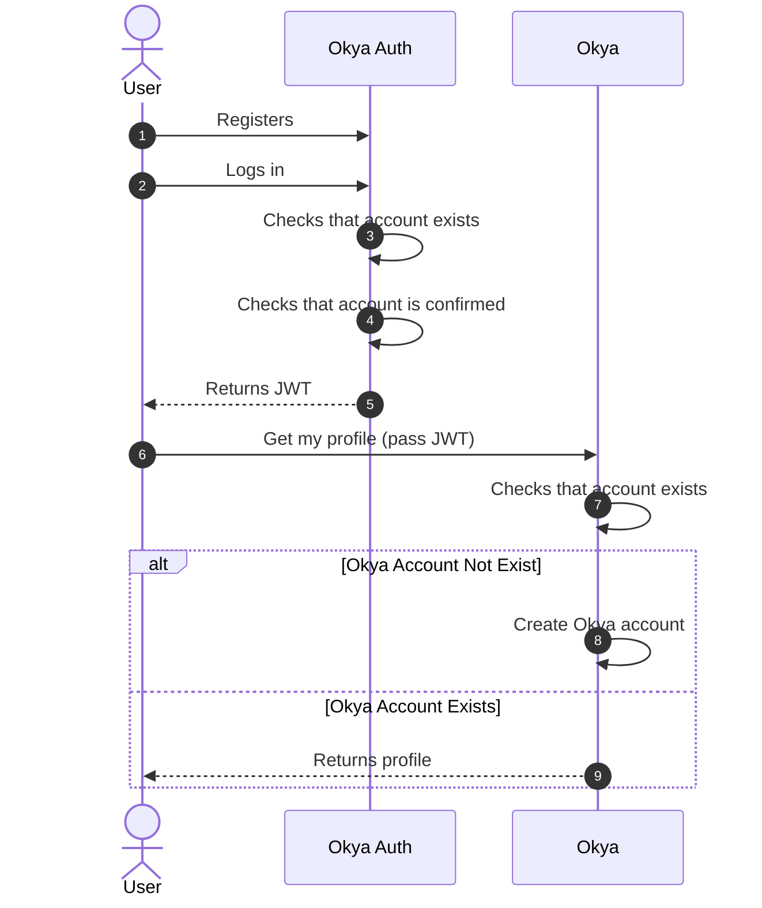

# Okya <> Okya Auth

```mermaid
sequenceDiagram
  autonumber
  
  actor User
  participant Auth as Okya Auth
  participant Okya as Okya
  
  User->>Auth: Registers
  User->>Auth: Logs in
  Auth->>Auth: Checks that account exists
  Auth->>Auth: Checks that account is confirmed
  Auth-->>User: Returns JWT
  User->>Okya: Get my profile (pass JWT)
  Okya->>Okya: Checks that account exists
  
  alt Okya Account Not Exist
	  Okya->>Okya: Create Okya account
  else Okya Account Exists
	  Okya-->>User: Returns profile
  end
```