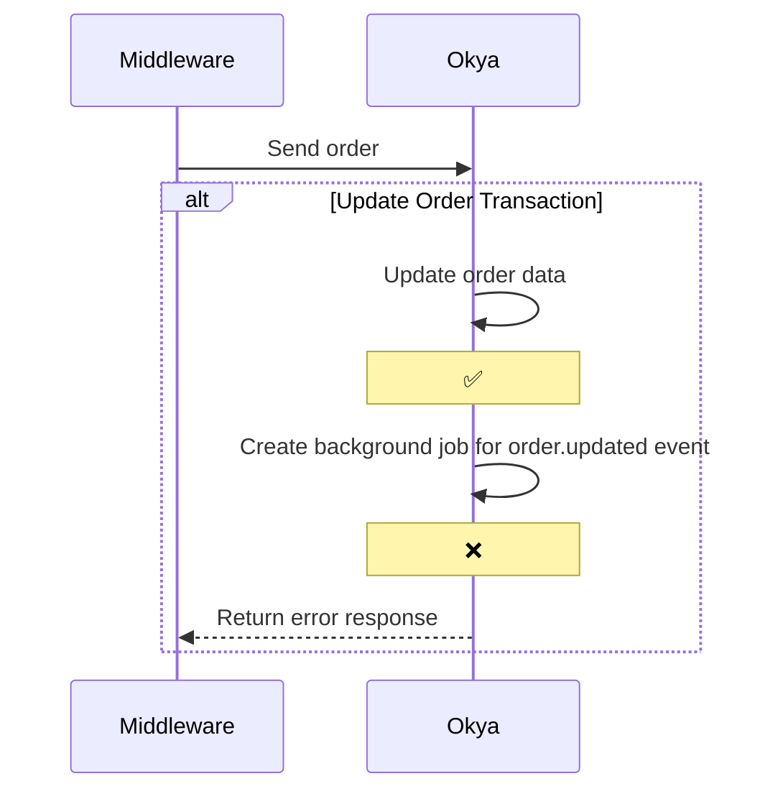

# Okya Orders Creation Error

# Explanation

The menu sync is a heavy, atomic process. Since it can update product prices, we must ensure that no pending orders are submitted with outdated prices.

To maintain data consistency, we apply a short database lock during the sync. It ensures that the update will go through and that no other transaction is processed at the same time.

There is another step after that, which is streaming the event to Kafka. There is no lock on this process, and the system got overloaded by the huge amount of menu sync that was done outside of agreed-upon hours. This failed, leading to a failed response from the API.